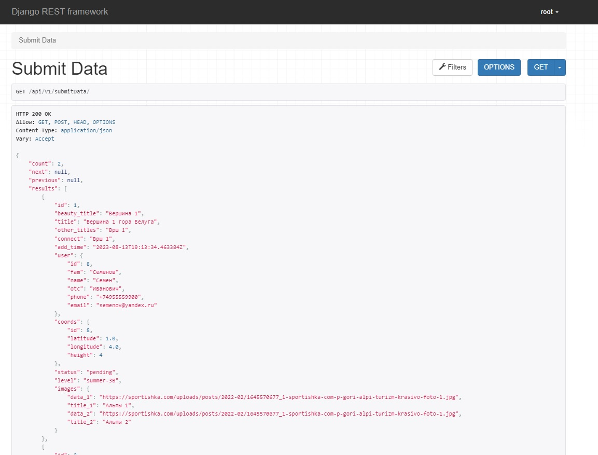
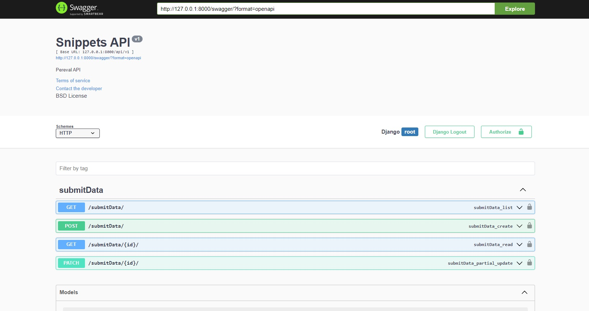

# Мобильное приложение mountains
### ОПИСАНИЕ
Данное мобильное приложение используется туристами для отправки данных о перевале на модерацию в ФСТР. 
Модератор из федерации верифицирует и вносит в базу данных информацию, а пользователи могут просматривать статус 
модерации и просматривать базу с объектами, внесенными другими.

### ИСПОЛЬЗУЕМЫ МЕТОДЫ:

**Метод  `POST /submitData/` - для отправки данных о перевале на сервер. Параметры запроса: JSON-объект с полями, 
описывающими информацию о перевале: beauty_title, title, other_titles, connect, add_time, user, coords, level, images.**

**Результат метода: JSON**

__status — код HTTP, целое число:__

- 500 — ошибка при выполнении операции;

- 400 — Bad Request (при нехватке полей);

- 200 — успех.

__message — строка:__

- Причина ошибки (если она была);
- Отправлено успешно;
- Если отправка успешна, дополнительно возвращается id вставленной записи.
id — идентификатор, который был присвоен объекту при добавлении в базу данных.

**Метод `GET /submitData/` - для получения одной записи (перевала) по ее id. 
Выводится вся информация об объекте, в том числе статус модерации.**

**Метод `PATCH /submitData/`- для редактирования существующей записи (перевала), если она в статусе "new". 
Редактировать можно все поля, кроме тех, что содержат в себе ФИО, адрес почты и номер телефона.** 

**Метод `GET /submitData/?user__email=` - для получения списка данных обо всех объектах, 
которые пользователь с определенной почтой отправил на сервер.** 

### ДОКУМЕНТАЦИЯ ПРОЕТА:

**Документация проекта с помощью Swagger используя генератор drf-yasg**  `swagger/`

### ФРЕЙМВОРКИ И БИБЛИОТЕКИ:

- Python 3.10.4
- Django 4.2.4
- Django REST framework 3.14.0
- Django-filter 23.1
- Python-decouple 3.8
- Drf-writable-nested 0.7.0
- Drf-yasg 1.21.7

### ПРОДАКШН ПРОЕТА:

**В течениe 30-дней проект будет размещаться на бесплатном хостинге по адресу:** `ru4515kq.beget.tech`

